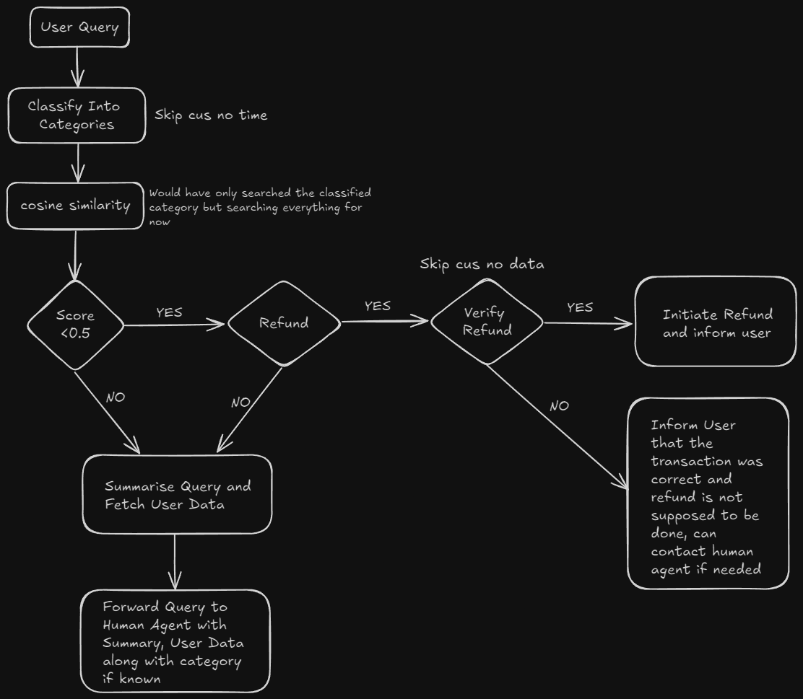

# <i>async</i>hrony

An LLM-powered personal agent that can dynamically generate queries for accurate personal financial data retrieval, efficiently classify user requests, and handle complaints in real-time, ensuring instant and precise responses.

## Features

- Transactional data retrieval
- Complaint handling

## Setup

1. Clone the repository/ Download the ZIP file

2. Install the required dependencies

```bash
pip install -r requirements.txt
```

3. Create a `.env` file in the root directory and add the following environment variables

```env
OPENAI_API_KEY=<YOUR_OPENAI_API_KEY>
```

4. Run the backend server

```bash
python main.py
```

5. Run the frontend server

```bash
cd client
npm install
npm run dev
```

6. Open a browser and navigate to `http://localhost:3000/`

7. Login with any user_id from 1 to 900 (Test database)

## Complaints Handling Flow


